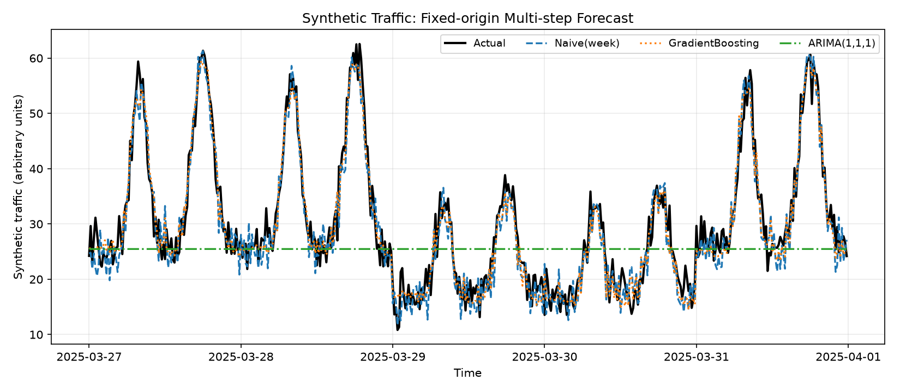
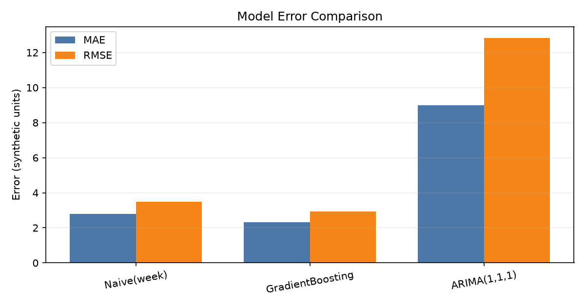

# Traffic Flow Forecast · 合成交通流量预测演示

本项目使用合成时序数据对比季节基线、梯度提升树与 ARIMA，展示时间切分、特征构造、固定起点多步预测和误差评估。

代码与数据为独立学习示例，不包含历史课程作业或商业项目的原始源码。

## 快速运行

建议 Python 3.10 或以上；已在 Python 3.12 的独立环境运行验证。

```bash
python -m venv .venv
# Windows PowerShell:
.venv\Scripts\Activate.ps1
# macOS/Linux:
# source .venv/bin/activate
python -m pip install -r requirements.txt
python -m unittest discover -s tests -v
python main.py
```

可调整最后的测试区间，例如 `python main.py --test-days 10`（允许 1–30 天）。运行会覆盖仓库内的生成数据和输出，不会读取外部交通数据。

## 数据与评估协议

- 数据完全由 `src/data_gen.py` 合成：90 天、15 分钟采样、早晚高峰、周末效应、缓慢趋势及随机噪声；固定随机种子为 42。
- 数值是连续的模拟强度，不是现场采集的整数车辆计数。起始日期 2025-01-01 只是生成器参数，不表示项目完成日期或采集时间。
- 默认以前 85 天训练，在同一个预测起点一次性预测最后 5 天；严格按时间先后切分，无随机拆分。
- 梯度提升使用时间特征、1 天/7 天滞后和日滚动统计。测试期未知滞后值由先前预测递归提供，不使用测试期真实流量。
- 周季节基线重复训练期最后一周；ARIMA(1,1,1) 仅拟合训练期。三种方法都不能接触测试期观测值。
- MAE、RMSE 越小越好；MAPE 单位为百分比，真实值为零的点仅从 MAPE 排除，全零时返回 NaN。所有点仍计入 MAE、RMSE。

## 输出

| 文件 | 内容 |
|---|---|
| `data/traffic_sample.csv` | 固定种子的合成输入 |
| `outputs/metrics.csv` | 模型评估数值 |
| `outputs/predictions.csv` | 测试时间、合成真值、各模型预测 |
| `outputs/forecast.png` | 固定起点多步预测曲线 |
| `outputs/model_compare.png` | MAE / RMSE 对比 |




## 一次默认运行结果

| 模型 | MAE | RMSE | MAPE (%) |
|---|---:|---:|---:|
| 周季节基线 | 2.794 | 3.493 | 10.552 |
| 梯度提升树 | 2.329 | 2.926 | 8.747 |
| ARIMA(1,1,1) | 9.004 | 12.839 | 27.825 |

以上仅为本仓库合成数据、固定随机种子和默认五天预测期的结果。环境：Python 3.12、NumPy 2.3.5、pandas 3.0.1、scikit-learn 1.9.1、statsmodels 0.15.0、matplotlib 3.11.2；不同依赖版本可能有细微差异。7 项单元测试通过。

## 代码结构

- `main.py`：生成数据、时间切分、模型训练、评估和保存。
- `src/data_gen.py`：合成数据和等间隔时间检查。
- `src/features.py`：仅用过去观测构造训练特征。
- `src/models.py`：模型拟合、季节基线和递归预测。
- `src/evaluate.py`、`src/visualize.py`：指标和图表。
- `tests/test_forecasting.py`：时间规则、训练/预测特征一致性、递归边界、基线与指标测试。

## 评估设计

各模型采用同一预测起点和测试区间，以保证比较口径一致。数据先按时间切分，再构造训练特征；梯度提升递归使用先前预测值生成未来特征，避免将测试期真实流量作为输入而造成数据泄漏。季节基线与 ARIMA 同样仅使用训练期观测值完成固定起点多步预测。

## 适用范围与局限

这是最小学习演示，不是生产级交通预测系统。合成数据有强规律，只使用一次时间留出评估，没有滚动回测、调参验证集、预测区间、节假日/天气特征，也没有性能或在线部署保证。ARIMA(1,1,1) 是简单非季节模型，不代表经过充分调参的统计模型效果。不能根据这里的模型排名推断真实道路效果。

接入真实数据前，需要明确数据许可、采样规则、缺失/异常值处理、训练验证测试划分和实际预测任务；不能只换 CSV 后直接引用指标作为业务效果。

